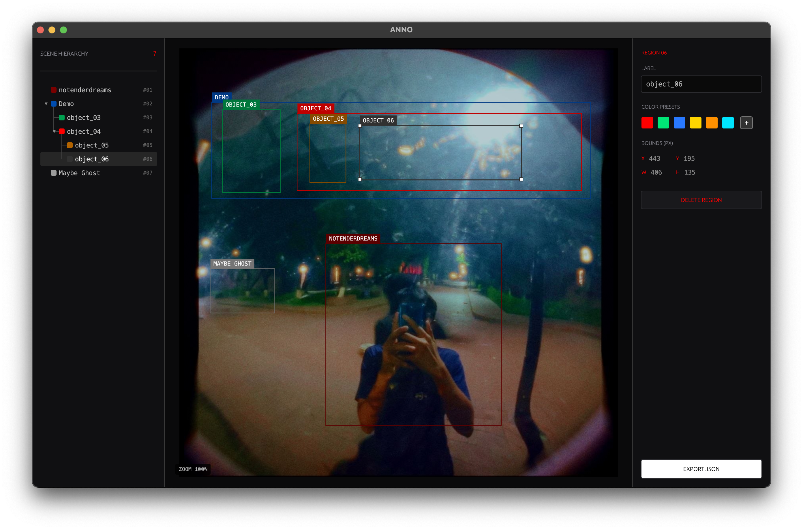

# anno



A focused desktop image annotator built with Rust and egui for preparing structured
computer-vision datasets. Draw precise regions, organize them into visual
hierarchies, and export nested JSON.

## Run

```sh
cargo run
```

Open a single image, drop a directory, or use `Open Folder...` (`Cmd+Option+O` / `Cmd+Shift+F`) to start annotating an entire dataset batch.

## Batch & Dataset Workflow

- **Folder Scanning**: Automatically detects all `.png`, `.jpg`, `.jpeg`, `.webp`, `.bmp`, and `.tiff` files sorted with natural alphanumeric ordering (`img1`, `img2`, `img10`).
- **Interactive Filmstrip**: Browse image pills in the bottom bar with live status indicators and annotation badges (`[3]`).
- **Seamless Auto-Saving**: Automatically saves each image's progress to a `<image_stem>.anno` sidecar file when navigating between images.
- **Batch Projects**: Save and reopen the full dataset state as one `.annobatch` file with `Cmd/Ctrl+S`.
- **Fast Navigation**: Move swiftly through the batch using `A` / `D` or `[` / `]`.

## Controls

- `Cmd/Ctrl+O` — open an image
- `Cmd/Ctrl+Option+O` / `Cmd+Shift+F` — open folder dataset
- `A` / `[` — previous image in dataset
- `D` / `]` — next image in dataset
- `Cmd/Ctrl+S` — save a single-image `.anno` project or multi-image `.annobatch`
- `Cmd/Ctrl+E` — export current image JSON
- `Cmd/Ctrl+Shift+E` — export unified dataset JSON
- `Cmd/Ctrl+Z` — undo
- `Cmd/Ctrl+Shift+Z` / `Cmd/Ctrl+Y` — redo
- `Delete` / `Backspace` — remove the selected region
- `Escape` — cancel drawing or deselect
- Scroll — zoom toward the cursor
- `Space` + drag or middle-drag — pan

## Export Formats

### 1. Unified Dataset Export (`Cmd+Shift+E`)

Compiles the entire folder of images and their hierarchical region annotations into a single structured dataset JSON:

```json
{
  "dataset_name": "surveillance_batch",
  "total_images": 28,
  "annotated_images": 14,
  "images": [
    {
      "image": "frame_001.jpg",
      "image_width": 1920,
      "image_height": 1080,
      "annotations": [ ... ]
    }
  ]
}
```

### 2. Single Image Export (`Cmd+E`)

Annotations are exported as nested JSON. Regions inside another region appear in
its `children` array:

```json
{
  "image": "/path/to/image.jpg",
  "image_width": 1024,
  "image_height": 1080,
  "annotations": [
    {
      "id": 1,
      "label": "notenderdreams",
      "x": 358.0,
      "y": 491.0,
      "width": 438.0,
      "height": 456.0,
      "color": [255, 0, 0]
    },
    {
      "id": 2,
      "label": "Demo",
      "x": 73.0,
      "y": 138.0,
      "width": 947.0,
      "height": 239.0,
      "color": [41, 121, 255],
      "children": [
        {
          "id": 3,
          "label": "object_03",
          "x": 99.0,
          "y": 155.0,
          "width": 146.0,
          "height": 208.0,
          "color": [0, 230, 118]
        },
        {
          "id": 4,
          "label": "object_04",
          "x": 286.0,
          "y": 165.0,
          "width": 711.0,
          "height": 194.0,
          "color": [255, 0, 0],
          "children": [
            {
              "id": 5,
              "label": "object_05",
              "x": 318.0,
              "y": 193.0,
              "width": 91.0,
              "height": 145.0,
              "color": [255, 145, 0]
            },
            {
              "id": 6,
              "label": "object_06",
              "x": 443.0,
              "y": 195.0,
              "width": 406.0,
              "height": 135.0,
              "color": [64, 64, 64]
            }
          ]
        }
      ]
    },
    {
      "id": 7,
      "label": "Maybe Ghost",
      "x": 68.0,
      "y": 553.0,
      "width": 162.0,
      "height": 112.0,
      "color": [190, 190, 190]
    }
  ]
}
```
